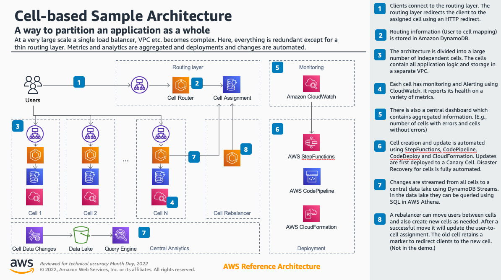

# Cellular Architecture

Reducing the blast radius of failures.

---

# Introduction

Blast radius is defined as the maximum impact that might be sustained in the event of a system failure.  Using a cellular architecture we can manage the size of the blast radius of any individual failure in a system.

A cell-based architecture, is an advanced resiliency architecture which creates partitions of a system, a collective of replicas each of which serves only a subset of the system's overall set of clients.  In this way, a failure which disrupts any one of the partitions is unlikely to affect the other partitions and the clients they support.

Other infrastructure techniques such as redundancy across AWS Availability Zones or across AWS Regions will protect against disruptions to individual server instances, disruption to an entire availability zone, or disruption to a regional AWS service.  But what about other types of disruption such as a malformed request, operator error, or a bad code deployment?

These types of failures can be partially mitigated using techniques like canary deployments, static tests, code reviews and automation.  But they only reduce the likelyhood and at large scale even unlikely events can occur regularly.  Using a cell-based architecture to implement fault isolation will reduce the blast radius of these kinds of failures.

For example, if due to a human error a main database is wiped, this will only affect one cell. For 1000 users, that would be only around 0.1% of the users. Plus, recovering a database with 0.1% of the data is much faster than recovering one with 100% of the data. 

To learn more about cell-based architectures please watch [How to scale beyond limits with cell-based architectures](https://youtu.be/HUwz8uko7HY).

# Architecture Overview

The cell-based key value store deployed creates a simple router which is responsible for assigning users to individual cells.  The client first authenticates to the router and is then given the address of the user's cell.  To then get or set key / value pairs the client connects to their assigned cell using the session token provided by the router.




# Solution Components

## Cells

A key characteristic of cell-based architectures is that every cell in the system is standalone, isolated from the other cells, with no dependency on other cells.  This results in multiple, smaller, copies of the entire application being deployed, each as an individual cell.  

The data required for or generated by each cell is also partitioned, so that there is no replication of data between cells.  This complete isolation of cells from one another is what limits the blast radius of a failure.

An additional benefit, aside from resilience to failure, is that the system naturally has an ability to linearly scale.  To add additional clients you need only deploy additional cells.

## Router

In this soluton, clients first connect to the cell router. The router authenticates the user (or creates a new user if it's a registration request) and returns the DNS name of the customer's assigned cell. The client then makes any subsequent requests to through this DNS name. Note that this is only one way to implement a cell router. Different options are possible, for example ones that are transparent to the client or that work through DNS routing.

# Design Considerations

## Number of cells

There is a tradeoff to be managed when determining the size of your cells.  Smaller cells have a reduced blast radius as they support fewer customers per cell.  Smaller cells are easier to test and deploy.  And smaller cells are easier to operate for their simplicity.  However, they increase complexity as you are likely to have a greater number of small cells which could lead to operational burden if not well automated.

Larger cells however provide cost efficiency, dedicating more users to any individual cell.  This reduction in splits between the cells also means that there are fewer cells to manage, reducing operational burden.

Larger cells are more easily operated and reduce operating costs but increase the blast radius of a failure while smaller cells decrease blast radius but increase operational burden if not well automated.  A key point to remember is that many who adopt cell-based architectures start with a small number of large cells and over time decrease their cell size as their tooling and automation develops.

## Monitoring

Creating multiple copies of a system to produce multiple, smaller cells will increase monitoring requirements.  Each cell will individually need to be monitored for health, using both white-box and black-box monitoring and business metrics.  You will also want to create aggregate metrics into healthy and unhealthy cells per metric.  Finally, you will want to ensure that messages and errors can be easily correlated with the cells.

## Deployment of cells

To manage the blast radius with respect to software changes within the cells we can think about release engineering concepts like fractional deployments.

A blue / green deployment strategy is an example of a fractional deployment.  Canary releases are another strategy - the key concept being making small, gradual changes to observe whether stability is maintained over the course of the release.  

It is important to allow for a 'bake time' during the release cycle.  After every incremental step in the release process allow a period of time to observe whether the release is causing any adverse behavior.  This bake time could be 15 min, an hour, or multiple hours depending on the characteristics of the system and when you have enough confidence that the release is working as expected.  

If the system stability looks like it may be waning don't hesitate to roll back before you hit a failure point.  It is better to have a fractional failure than to have a whole sub-system fail.  And be particularly careful with stateful changes that can't be sharded or partitioned as those tend to be one-way doors that are more challenging to recover from.

## Routing

Any cell-based architecture will have a requirement to direct client traffic to individual cells.  This requirement is implemented using a routing layer that sits between the client and the cells.

There are different ways to implement the routing layer.  Each one has advantages and disadvantages and different scenarios to which each is best suited. Below are three examples of how a routing layer can be implemented.

The first type of routing layer acts as a load balancer.   I.e., the router accepts connections and and forwards them to the cell, relaying any packages then back to the clients.  This is transparent to clients as the clients are always speaking to a single fully qualified domain name resource.  However, it puts the routing layer in the critical path for all transactions with the cells as they pass through the routing layer.

The second type of routing layer will have the routing layer forwarding requests to the cells.  This has the benefit of being simple to implement.  Also, the routing layer is only needed during the initial connection of the client to the cell.  After that any disruption to the routing layer will not disrupt already established client-cell connections.  However, custom logic is required in the client to communicate with the routing layer to obtain the FQDN of the cell to which the client is assigned.  This could also lead to a potentially higher latency.

The third type of routing layer is to use the Domain Naming Service (DNS).  This has the benefit that the DNS system is highly reliable and is simple to set up.  However, it puts a requirement on the client to be able to map users to the right cell through DNS.

## Routing layer resilience

As suggested above, the routing layer has the risk of being a single point of failure.  To improve the resilience of the routing layer we can use patterns like separating the control plane from the data plane.  We can also deploy multiple copies of the data plane behind a load balancer.  And employ advanced patterns like constant work to improve the predictability of the routing layer data plane.

## Other considerations

Moving to a cell-based architecture may require that the data architecture be re-examined, in order to partition the data and split it across multiple databases.  

Other considerations include whether cells should be in individual AWS accounts.  Creating many AWS accounts can become unwieldy.  They need to integrate with the billing, monitoring, etc. But on the other hand multiple accounts limit the blast radius of events such as compromised account credentials or service limits.

Consider whether authentication should occur at the cell or the router, and where should the credentials be stored?  Authentication can happen in the router or in the cells.  Having it in the cells limits the blast radius while performing authentication and authorisation at the routing layer adds simplicity.

With multi-layered architectures cells need to talk to cells in other layers.  A single Transit Gateway can orchestrate this but becomes a single point of failure.  If frontend cells can be limited to a small set of backend cells then bilateral connections can be used.

SSL Certificates can also be single points of failure if they are allowed to expire or if a bad update occurs making the certificate invalid for its host.  Ideally each cell uses a unique certificate with a unique expiration date.

Team boundaries should also be considered.  Each layer of cells is handled by a single team.  This team might provide the cell infrastructure for multiple teams, deploying services in the cell.  Or teams can provide libraries that the cell owner uses.

Disaster Recovery also needs to be reexamined.  Failover to a different region (if required) can be handled by each cell or centrally.  A failover strategy per cell can also help with catastrophic failures within a cell, for example when a database table is accidentally deleted.

# Deployment

## Prerequisites

1. You will need a Linux or macOS environment in which to run commands. This can also be an EC2 instance or Cloud9 environment.
1. Docker, python and npm need to be installed. 
1. You need to have an AWS account and have permissions to run commands in it.
1. The region needs to be set. (For example, by setting the environment variable AWS_REGION)
1. The routing layer and each cell will create an Elastic IP, VPC and NAT Gateway. You may need to raise the limits on these resources. (An initial limit increase often is autoapproved within a few seconds.) See https://docs.aws.amazon.com/general/latest/gr/aws_service_limits.html for details. Any stacks that fail with a limit being exceed you will need to destroy and manually recreate. It is always recommended to monitor AWS service limits and proactively increase them when you start approaching one of them.

## Folder Structure

- cdk: Contains CDK files to build three stacks: One for ECR repos, one for the central routing components and one for cells. The last one will be deployed multiple times.
- cell-container: The container and code that runs within a cell.
- router-container: The container that runs within the cell router.
- cellularctl: The cellularctl command line.
- client: A python client. Mainly used for automated test of router functionality.
- cells_for_codepipeline: Lambda function that runs as part of CodePipeline to orchestrate updates.

## Configure the `cellularctl`

Most actions can be done via cellularctl. You need to install the required modules. A python venv can be created like this:

```
python -m venv .venv
source .venv/bin/activate
pip install -r requirements.txt
```

Afterwards you can run cellularctl:

```
./cellularctl
```

## Deploy the Cell-based Architecture

Using the commands below configure CDK to proceed without requiring interactive approval.  Then instruct the `cellularctl` tool to deploy the cell-based architecture using CloudFormation and AWS CDK:

```
export cdkRequireApproval=never
./cellularctl setup deploy --createcells=True
```

For more about AWS CDK and its environment variables see https://docs.aws.amazon.com/cdk/v2/guide/cli.html#cli-deploy.

The solution may take a number of minutes to fully deploy after the above steps.  Check in Step Functions State machines view to look for completed execution on the `Cellular-CheckCanary` job.

### Updating the solution

After updating the router CDK component run the following. This will trigger a CDK build but not deploy the routing container.

```
./cellularctl router deploy
```

After updating the router CDK component run the follwing. This will trigger generate a new CDK template and upload it to S3. This in turn will trigger a CodePipeline that first updates the sandbox cell, checks it for alivenss and then updates all other cells.

```
./cellularctl cell generate_template
```

To build and push a new container for the cell router run the following. '--deploy' will trigger a refresh in ECS, so that the current deployement uses the image.

```
./cellularctl router build --deploy
```

To build and push a new container for the cells run the following. '--deploy' will trigger a refresh in ECS, so that the current deployement in each cell uses the image.

```
./cellularctl cell build --deploy
```

To update everything run the following:

```
./cellularctl router build --deploy
./cellularctl cell build --deploy
./cellularctl router deploy
./cellularctl cell generate_template
```

Note that most of these commands return before the update has fully finished deploying. You can observe the deployment in CodePipeline or ECS.

## Using the solution

### Using the `clientctl` convenience tool

The cell-based architecture operates as a key / value store where it partitions users across the cells.  To interact with the system begin by creating a couple of users:

```bash
./cellularctl router getdnsname
export routerurl=$(./cellularctl router getdnsname)
./clientctl register user1
./clientctl register user2
```

Then put and get some key / value pairs using the different users:

```bash
./clientctl exec put user1 foo bar
./clientctl exec put user2 foo baz
./clientctl exec get user1 foo
./clientctl exec get user2 foo
```

To observe which cell a user is allocated to, you can use the `getcell` parameter 
```bash
./clientctl exec getcell user1
./clientctl exec getcell user2
```

### Using the `curl` tool

To see how the communication is handled you can use the `curl` command to interact with the cell-based architecture.  Using the same `routerurl` environment variable defined above try the following:

```bash
# register a user3 with the system
result=$(curl -X POST "$routerurl/register" -H 'Content-Type: application/json'  -d '{"username": "user3"}') 
# store the apikey for next steps
user3apikey=$(echo $result | jq .apikey)

# next login to the system to see which cell the user is assigned to
result=$(curl -X POST "$routerurl/login" -H 'Content-Type: application/json'  -d "{\"username\": \"user3\", \"apikey\": $user3apikey}")

# save the cell DNS name and bearer token
export CELL="http://$(echo $result | jq .dns_name_cell -r)"
export TOKEN="$(echo $result | jq .token -r)"

# put a value into the cell
curl -X POST $CELL/put -H 'Content-Type: application/json' -H 'Authorization: Bearer '$TOKEN -d '{"key": "foo", "value": "biz"}'

# get the same value back out
curl -X POST $CELL/get -H 'Content-Type: application/json' -H 'Authorization: Bearer '$TOKEN -d '{"key": "foo"}'
{"value":"biz"}
```

### Getting cell assignments

To list currently registered users run the following:

```
./cellularctl user list
```

To get the cell assignment for a user (with name "username") run the following:

```
./cellularctl user cell username
```

## Uninstalling the Solution

In order to uninstall the solution, delete all CloudFormation staks that were created. You can use the following command to trigger a destroy action on all those stacks. 

```bash
./cellularct setup destroy
```

Note that the command does not wait for the actions to finish. Be sure to go to the CloudFormation console and clean up any stacks that failed to destroy automatically.

# Advanced Patterns

## Decoupling storage and compute

This solution bundles the storage and compute into an individual cell.  However a cell-based architecture can be designed to have a stateless front layer and a stateful backend layer.  The frontend can the be treated as disposable.  If a deployment to a cell breaks, it can be discarded.

In the backend we can implement recovery between cells.  For example by replicating data in an active-passive fashion.  Or even writing to multiple cells and using a quorum to guarantee consistency.

Using a stateless frontend also opens the door to other patterns such as shuffle sharding.

## Cost Optimization

Some resources in your architecture will have a fixed cost.  Adding these resources to each cell, reduces the failure scenarios but increases their cost.  Allocating the resources centrally means we need to be careful about making changes to them.  

We can also think about a tiered approach where we have some parts of the infrastructure where we have a small blast radius and therefore need fewer controls and central resources for which we need tighter controls.  Or cells can be bundled. For example one VPC and the associated resources for 10 cells.  This means that we still reduce the blast radius but at a tenth of the cost.

## Multi-cell Transactions

Consider whether requests should span cells.  This is a map-reduce approach where an external service coordinates a workflow across the cells.  This service should go to the cells through their external endpoints and not access any internals directly.  This may become necessary but will significantly increase the complexity of the solution so leverage this pattern with care.

## Scaling out for Complex Systems

Larger, more complex systems can look like microservices.  Many of the patterns from that world can apply here as well.  A cell may internally still be composed of multiple microservices.  The size of the cells is important and remember Conway's law which would have the system architecture reflect the organization's structure; this may not be the optimal system architecture.  Complexity will increase as more layers are added.

# Contributors

The following individuals contributed to this document:

- Robert Himmelmann
- Jason Barto

# Related Documentation

https://docs.aws.amazon.com/wellarchitected/latest/reducing-scope-of-impact-with-cell-based-architecture/reducing-scope-of-impact-with-cell-based-architecture.html

https://docs.aws.amazon.com/wellarchitected/latest/reliability-pillar/rel_fault_isolation_use_bulkhead.html

# Revisions

| Date | Change |
| ---- | ------ |
| Nov 2023 | Initial release |

# Notices

Customers are responsible for making their own independent assessment of the information in this document. This document: (a) is for informational purposes only, (b) represents AWS current product offerings and practices, which are subject to change without notice, and (c) does not create any commitments or assurances from AWS and its affiliates, suppliers or licensors. AWS products or services are provided “as is” without warranties, representations, or conditions of any kind, whether express or implied. AWS responsibilities and liabilities to its customers are controlled by AWS agreements, and this document is not part of, nor does it modify, any agreement between AWS and its customers.

# AWS Glossary

For the latest AWS terminology, see the [AWS glossary](https://docs.aws.amazon.com/general/latest/gr/glos-chap.html) in the AWS General Reference.

---

# MARK FOR DELETION

## Scenarios

This architecture is designed to limit the blast radius of bad deployments, human error and poison pill scenarios. Cells don't share resources and failure of once cell won't affect other cells.

In order to simulate a bad deployment, uncomment the line
```
this.create_denyNacls(vpc)
```

in cell-stack.ts. Then execute the following:

```
./cellularctl generate_template
```

This will generate and upload a new version of the cell template which now contains a Network ACL that denies all outgoing traffic for all resources in the cell VPC.
The new template will trigger an execution of the codepipeline. The deployment to the sandbox cell will be successfull but the canaries will fail afterwards and halt the deployment.
Here, the canaries simulate a business metrics. For example, after a new deployment to a cell, a increase in support cases or a decrease in sales would be an indication that something is wrong and that the new change shouldn't be deployed to more cells.
